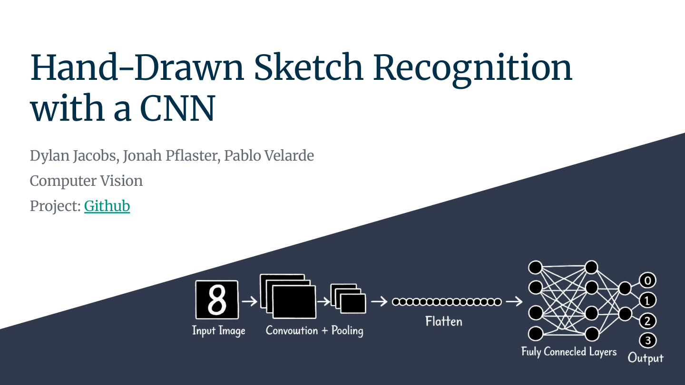
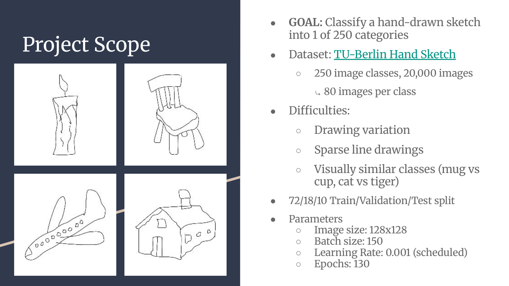
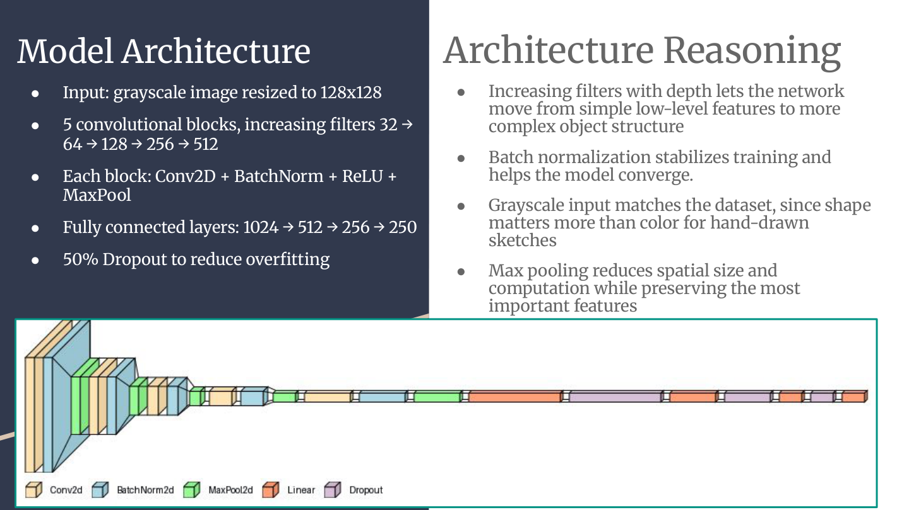
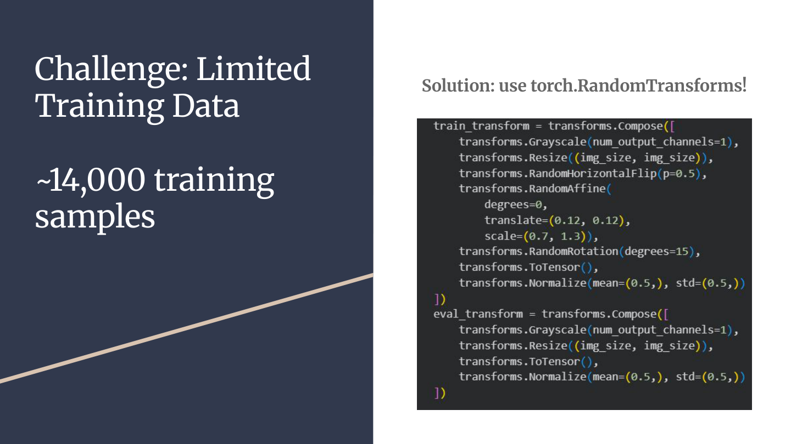
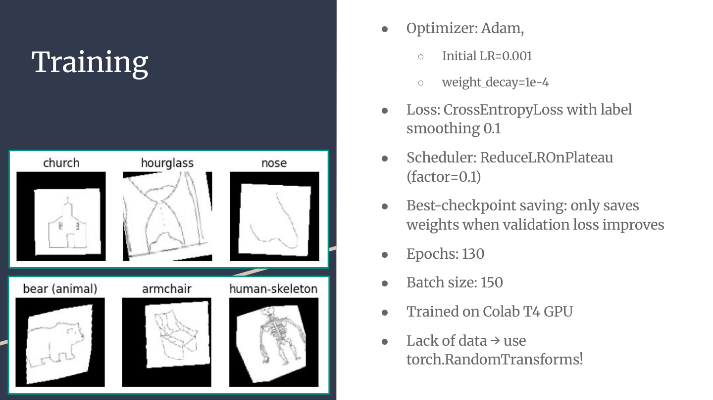
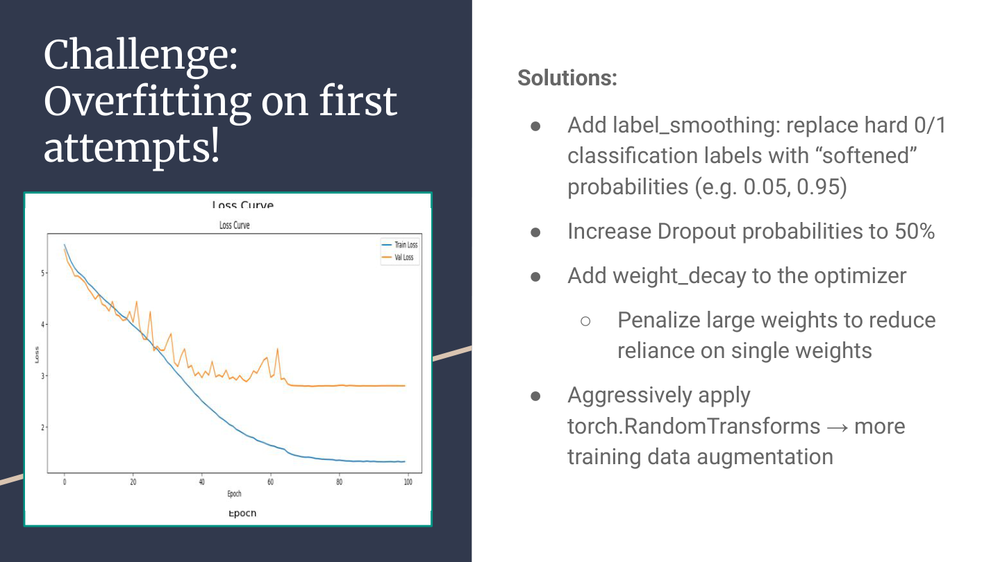
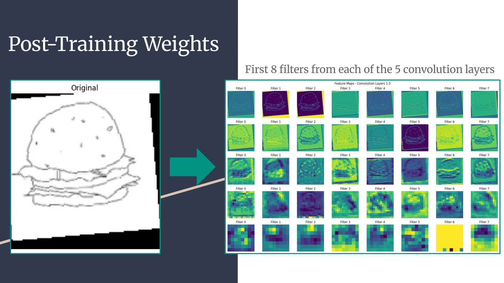
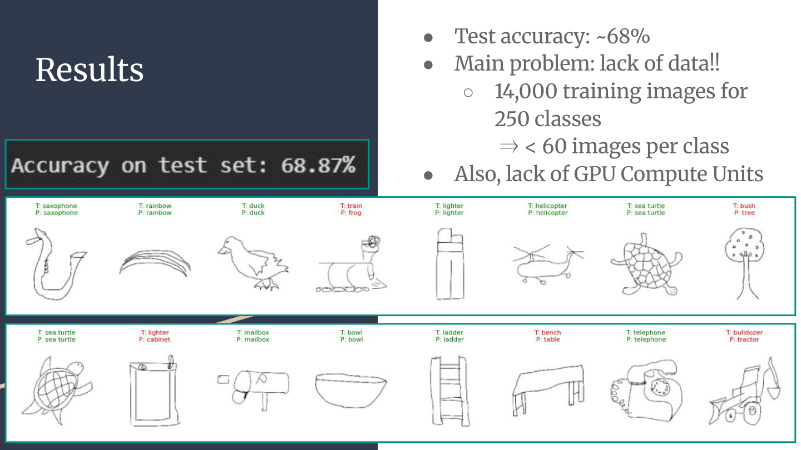
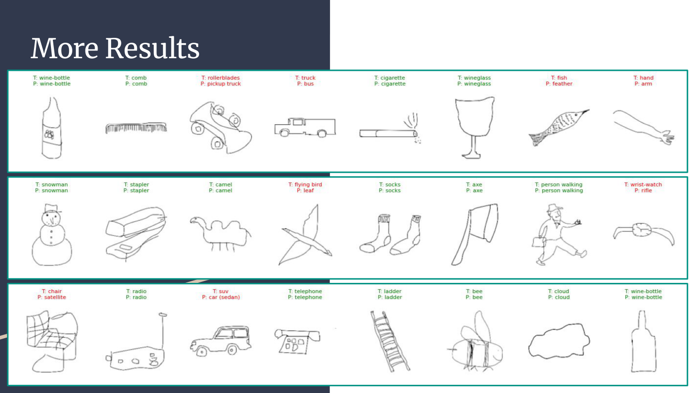
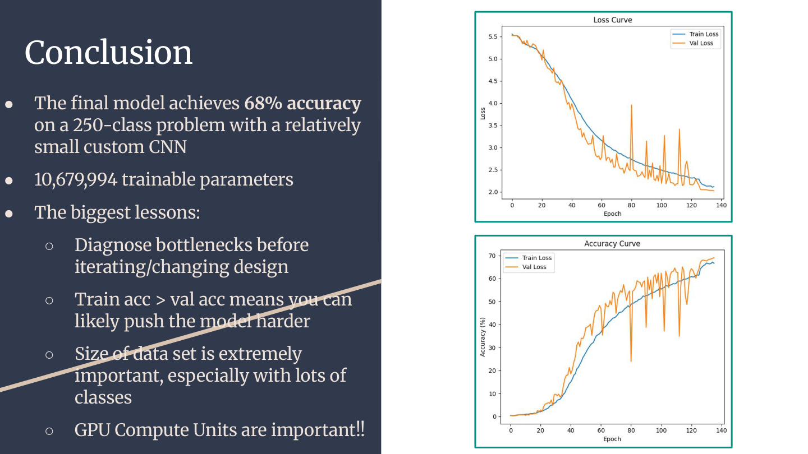

> Author: Dylan Jacobs

Project: [Github](https://github.com/dylan-jacobs/CNN-Drawing-Recognition)
**Interactive project demonstration:** [Click here](https://dylan-jacobs.github.io/cnn-hand-drawn-image-predictor-interactive-demo) to try out the model yourself

## Slide 1

---

## Slide 2

Project Scope  
● GOAL: Classify a hand-drawn sketch into 1 of 250 categories  
● Dataset: TU-Berlin Hand Sketch  
    ○ 250 image classes, 20,000 images  
    ⤷ 80 images per class  
● Difficulties:   
    ○ Drawing variation  
    ○ Sparse line drawings  
    ○ Visually similar classes (mug vs cup, cat vs tiger)  
● 72/18/10 Train/Validation/Test split  
● Parameters:  
    ○ Image size: 128x128  
    ○ Batch size: 150  
    ○ Learning Rate: 0.001 (scheduled)  
    ○ Epochs: 130  

---

## Slide 3

Model Architecture  
● Input: grayscale image resized to 128x128  
● 5 convolutional blocks, increasing filters 32 → 64 → 128 → 256 → 512  
● Each block: Conv2D + BatchNorm + ReLU + MaxPool  
● Fully connected layers: 1024 → 512 → 256 → 250  
● 50% Dropout to reduce overfitting   

 
Architecture Reasoning  

Increasing filters with depth lets the network move from simple low-level features to more 
complex object structure  
● Batch normalization stabilizes training and helps the model converge.  
● Grayscale input matches the dataset, since shape matters more than color for hand-drawn 
sketches  
● Max pooling reduces spatial size and computation while preserving the most important features  

---

## Slide 4

Challenge: Limited Training Data  
~14,000 training samples  
Solution: use torch.RandomTransforms!  

---

## Slide 5

Training  
● Optimizer: Adam     
    ○ Initial LR=0.001  
    ○ weight_decay=1e-4  
● Loss: CrossEntropyLoss with label smoothing 0.1  
● Scheduler: ReduceLROnPlateau (factor=0.1)  
● Best-checkpoint saving: only saves weights when validation loss improves  
● Epochs: 130  
● Batch size: 150  
● Trained on Colab T4 GPU  
● Lack of data → use torch.RandomTransforms!  

---

## Slide 6

Challenge: Overfitting on first attempts!  

Solutions:  
● Add label_smoothing: replace hard 0/1 classification labels with “softened” probabilities (e.g. 0.05, 0.95)  
● Increase Dropout probabilities to 50%  
● Add weight_decay to the optimizer  
    ○ Penalize large weights to reduce reliance on single weights  
● Aggressively apply torch.RandomTransforms → more training data augmentation  

---

## Slide 7

Post-Training Weights  
First 8 filters from each of the 5 convolution layers  

---

## Slide 8

Results  
● Test accuracy: ~68%   
● Main problem: lack of data!!  
    ○ 14,000 training images for 250 classes  ⇒ < 60 images per class  
● Also, lack of GPU Compute Units  

---

## Slide 9

More Results

---

## Slide 10

Conclusion
● The final model achieves 68% accuracy on a 250-class problem with a relatively small custom CNN  
● 10,679,994 trainable parameters  
● The biggest lessons:  
    ○ Diagnose bottlenecks before iterating/changing design  
    ○ Train acc > val acc means you can  likely push the model harder  
    ○ Size of data set is extremely important, especially with lots of classes  
    ○ GPU Compute Units are important!!  

---

